# Project Goal

“To provide data-driven insights into UK property sales trends, regional price variations, and buyer behaviour using HM Land Registry data to assist investors, financial institutions, and policymakers in decision making”.

In order to satisfy the project goal, the following business challenges will be explored:
1.	How have UK house prices and transaction volume changed over time?
2.	Which areas have seen the highest and lowest price growth and transaction volume?
3.	How do property types impact pricing trends and transaction volume?
4.	What is the impact of duration (Freehold Vs. Leasehold) on price and transaction volume?
5.	How do new-build properties compare to older ones in terms of price and volume?

# Business Context: Who Will Benefit?

The following outlines the stakeholders that will benefit from the project, the insights they will gain from it, and how they can be applied in real-world scenarios:

- **Home Buyers and Sellers**: Understanding provided with regard to affordable areas and price trends, which in turn aids buyers making buying or selling decisions, as they will be informed and data-driven based on market data.
- **Property Investors & Developers**: Aids in the identification of high-growth areas, regions with undervalued properties and market trends. Enables strategic investment decisions to be made into emerging locations with strong price appreciation, whilst avoiding declining markets and overvalued properties.
- **Banks and Mortgage Brokers**: Provides a data-driven risk assessment of property values and price trends, promoting the creation of competitive, adjusted mortgage policies that take the data into account.
- **Local Government & Urban Planners**: Insight gained into regional housing demand and transaction activity, which would facilitate the planning of new developments in high-demand areas e.g. housing projects & infrastructure investments.
- **Housing Policy Makers**: Understanding gained with regard to affordable housing trends and price inflation, which would allow for the more effective design of policies to improve affordability in struggling areas and regulate new developments.
- **Property Agents & Solicitors**: Insight gained into buyer preferences and regional transaction trends, lend support when advising clients on the best locations and times to buy and sell.

# Tools Utilised:

In order to progress with the investigation of sales trends using HMLR data, several key tools were made use of:

- **Python**: The coding language used to analyse, clean and carry out Dimensional Data Modelling on the data.
- **Pandas Library**: Used to support in the activities mentioned above.
- **Jupyter Notebooks**: Allows the running of Python scripts in such a way that you can include both notes and scripts simultaneously.
- **SQL**: Used to create a relational database, FACT and DIM tables, upload the data and carry out queries on the data 
- **SQLTools Extension**: Connects chosen IDE to the chosen SQL database manager, so that queries (and more) can be carried out in the chosen IDE after establishing a connection.
- **PGAdmin4**: The chosen SQL database manager.
- **Visual Studio Code**: The IDE chosen for executing Python scripts and SQL queries.
- **Tableau Public**: The tool used to create dashboards from the data.
- **Git & Github**: Essential for version control and sharing work (e.g. Python code, SQL queries, Tableau dashboards), ensuring collaboration and project tracking.

# About HM Land Registry

HM Land Registry (HMLR) is a UK government department responsible for registering the ownership of land and property in England and Wales. It maintains a central database of property ownership, mortgages, and rights affecting land. Key functions include:
- **Registering Land and Property**: Ensures ownership is officially recorded.
- **Providing Property Information**: Offers access to title deeds, ownership details, and property boundaries.
- **Guaranteeing Property Ownership**: Provides legal security and protection for property owners.
- **Supporting Property Transactions**: Facilitates buying, selling, and mortgaging of properties.
- **Resolving Land Disputes**: Helps clarify legal rights over land.

It plays a crucial role in property transactions, ensuring transparency and reducing fraud. Property investors or developers regularly interact with HMLR for title searches, ownership verification, or boundary issues.

# HMLR Price Paid Data Background

HMLR Price Paid Data tracks property sales in England and Wales submitted to HM Land Registry for registration. Price Paid Data is based on the raw data released each year. 

The amount of time it takes to register a sold property’s information with the HMLR can vary depending on various factors e.g. it might take longer to document a sold property’s information in Wales, than in England. The interval between sale and registration typically ranges between two weeks and two months, but occasionally, it has taken longer than two months. This means there might be a lag of up to two months with some data, therefore, November and December may be lighter than they should be.

Ordinarily, in our case, this would affect 2024 data, however, now that we are few months into 2025, i was able to get the 2024 transactions from the 2024 data and transpose them into the 2024 sheet, mitigating the above issue.

Please note that the data excludes:
- Sales that have not been lodged with HM Land Registry
- Sales that were not for value
- Transfers, conveyances, assignments or leases at a premium with nominal rent, which are:
  - ‘Right to buy’ sales at a discount
  - Subject to an existing mortgage
  - To effect the sale of a share in a property, for example, a transfer between parties on divorce
  - By way of a gift
  - Under a compulsory purchase order
  - Under a court order
  - To Trustees appointed under Deed of appointment
  - Vesting Deeds Transmissions or Assents of more than one property

The below table will make sense of what each column in the txt files means:

| Column Name                   | Explanation                                              |
| ----------------------------- | -------------------------------------------------------- |
| Transaction Unique Identifier | A Reference Number which is generated automatically recording each published sale. The number is unique and will change each time a sale is recorded. |
| Price                         | Sale price stated on the transfer deed. |
| Date of Transfer              | Date when the sale was completed, as stated on the transfer deed. |
| Postcode                      | This is the postcode used at the time of the original transaction. Note that postcodes can be reallocated and these changes are not reflected in the Price Paid Dataset. |
| Property Type                 | D = Detached, S = Semi-Detached, T = Terraced, F = Flats/Maisonettes, O = Other. Note that we only record the above categories to describe property type, we do not separately identify bungalows. End-of-terrace properties are included in the Terraced category above. ‘Other’ is only valid where the transaction relates to a property type that is not covered by existing values, for example where a property comprises more than one large parcel of land |
| Old/New                       | Indicates the age of the property and applies to all price paid transactions, residential and non-residential. Y = a newly built property, N = an established residential building. | 
| Duration                      | Relates to the tenure: F = Freehold, L= Leasehold etc. Note that HM Land Registry does not record leases of 7 years or less in the Price Paid Dataset. |
| PAON	                        | Primary Addressable Object Name. Typically the house number or name. |
| SAON                          | Secondary Addressable Object Name. Where a property has been divided into separate units (for example, flats), the PAON (above) will identify the building and a SAON will be specified that identifies the separate unit/flat. |
| Street	                    | A public road in a city, town or village, typically with houses and buildings on one or both sides. |
| Locality	                    | An area or neighbourhood. |
| Town/City	                    | A populated are with fixed boundaries and a local government |
| District	                    | An area of a country or city, especially one characterised by a particular feature or activity |
| County	                    | An area of a state or country that is larger than a city and his its own government to deal with local matters |
| PPD Category Type             | Indicates the type of Price Paid transaction. A = Standard Price Paid entry, includes single residential property sold for value. B = Additional Price Paid entry including transfers under a power of sale/repossessions, buy-to-lets (where they can be identified by a Mortgage), transfers to non-private individuals and sales where the property type is classed as ‘Other’. Note that category B does not separately identify the transaction types stated. HM Land Registry has been collecting information on Category A transactions from January 1995. Category B transactions were identified from October 2013.
| Record Status – Monthly File Only	| Indicates additions, changes and deletions to the records: A = Addition, C = Change, D = Delete. Note that where a transaction changes category type due to misallocation (as above) it will be deleted from the original category type and added to the correct category with a new transaction unique identifier.

# Dimensional Data Modelling (Planning)

Before proceeding with anything code related, we must plan how we should split the above dataset into FACT and DIM tables, in order to form a star schema structure. Doing this ensures efficient querying, reporting and visualisation, thus optimising performance for SQL queries and Tableau visualisations. 

The concept behind how the HMLR price paid dataset will be split into FACT and DIM tables is documented below:

## FACT Table: FACT_price_paid

This table stores all property sales data and links to various dimension tables for further analysis:

| Column Name              | Description                                                   |
| ------------------------ | ------------------------------------------------------------- |
| transaction_id (PK)      | Same as ‘Transaction Unique Identifier’, just renamed. Unique identifier for each sale, as recorder in the dataset |
| price                    | Sale price stated on the transfer deed |
| date_of_transfer_id (FK) |	Foreign key linking to dim_date. ID derived from ‘Date of Transfer’ column in original dataset. |
| location_id (FK)         | Foreign key linking to dim_location. ID derived from various columns pertaining to location in the original dataset e.g. ‘postcode’, ‘county’ etc. |
| property_type_id (FK)    | Foreign key linking to dim_property_type. ID derived from ‘Property Type’ column in original dataset. |
| old_or_new_id (FK)       | Foreign key linking to dim_old_new. ID derived from ‘Old/New’ column in original dataset. |
| duration_id (FK)          | Foreign key linking to dim_duration. ID derived from ‘Duration’ column in original dataset. |

## DIM Table: DIM_date

This table allows for time-based analysis such as yearly trends and seasonal patterns:

| Column Name              |	Description                          |
| ------------------------ | --------------------------------------- |
| date_of_transfer_id (PK) | Unique identifier of each date |
| date_of_transfer         | Actual sale date |
| year                     | Extracted year from date_of_transfer |
| month                    | Extracted month from date_of_transfer |
| quarter                  | Extracted quarter from date_of_transfer |

## DIM Table: DIM_location

Stores location based insights for regional analysis:

| Column Name      |	Description                                                        |
| ---------------- | --------------------------------------------------------------------- |
| location_id (PK) | Unique identifier for location |
| postcode         | Property postcode at the time of the transaction. Same as column in the original dataset with the same name. |
| paon             | Primary addressable object name (house number or name). Same as column in the original dataset with the same name. |
| saon             | Secondary addressable object name (e.g., flat number). Same as column in the original dataset with the same name. |
| street           | Street name. Same as column in the original dataset with the same name. |
| locality         | Local Area Name. Same as column in the original dataset with the same name. |
| town_city        | Town or City where the property is located. Same as column in the original dataset with the same name. |
| district         | Administrative district. Same as column in the original dataset with the same name. |
| county           | County where the property is located. Same as column in the original dataset with the same name. |

## DIM Table: DIM_property_type

Stores data regarding the type of property purchased:

| Column Name | Description |
| --- | --- |
| property_type_id (PK) | Unique identifier for each property type. ID derived from ‘Property Type’ column in original dataset. |
| property_type | Type of property: Detatched (D), Semi-Detached (S), Terraced (T), Flat (F), Other (O). Same as ‘Property Type’ column in the original dataset. |

## DIM Table: DIM_old_or_new

Facilitates comparisons between new builds and previously estabilshed residential properties:

| Column Name |	Description |
| --- | --- |
| old_or_new_id (PK) | Unique identifier for property age. ID derived from ‘Old/New’ column in original dataset. |
| old_or_new | Property age: New (Y), Old (N). Same as ‘Old/New’ column in the original dataset. |

## DIM Table: DIM_duration

Allows analysis of Freehold vs. Leasehold pricing differences.

| Column Name | Description |
| --- | --- |
| duration_id (PK) | Unique identifier for each duration type. ID derived from ‘Duration’ column in original dataset. |
| duration | Duration type: Freehold (F), Leasehold (L). Same as ‘Duration’ column in the original dataset. |

## Star Schema Diagram

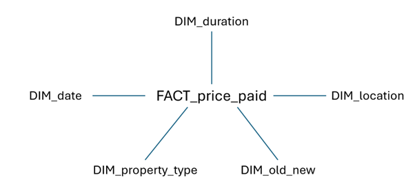

# Data Preparation & Cleaning 

Before even thinking about progressing to the questions, steps must be taken to ensure the data is suitable before generating FACT and DIM tables and loading it in.

## Import & Merge Data Files

The below code allows for the importing and merging of all the HMLR price paid txt files into one large dataset. Each txt file contained a years worth of data (e.g. one txt file would be for 2018, another for 2019 until 2024), so they must be merged into one large dataset to facilitate later analysis.

```python
# Imports the necessary library so the below can happen
import glob

# Find all .txt files in a folder
file_list = glob.glob(r"C:\Users\Vikram Kapoor\OneDrive\CURRENT LAPTOP\Independent Study\Coding\SQL\HMLR_Price_Paid_Project_SQL\1. origin_txt_files/*.txt")

# Reads all .txt files and concatenates them into a single Pandas dataframe
df_list = [pd.read_csv(file, delimiter =',') for file in file_list]
combined_df = pd.concat(df_list, ignore_index = True)
```

## Handle Missing Data

The logic behind the below code is to begin by identifying the number of NAs and blanks in the data. After carrying this out, we could conclude that there were NAs in the following columns:
- postcode
- saon
- street
- locality

I came to the conclusion that since location columns such as town_city, district and county were fully populated, they would suffice in the analysis of trends with regard to location. Whilst it would be nice to do it by postcode for example, county and district encompass a wide enough area such that carrying out analysis on these columns would still provide fruitful data, thus drawing meaningful insights.

I proceeded to change the NAs in the dataset to blanks (''), and confirmed i was successful with the final piece of code, which confirmed the number of blanks in the dataset.

```python
# Identifies no. of NANs in each column
combined_df.isna().sum()

# Identifies no. of Blanks in each column
(combined_df == '').sum()

# Fill all NaNs in dataset with blanks
combined_df.fillna('', inplace = True)

# Confirms no. of Blanks in each column
(combined_df == '').sum()
```

## Fix Incorrectly Inputted Data

When I attempted to carry out filters on the dataset, I found myself getting errors I shouldn't have been getting. After much investigation, I found that there were random spaces before and after the column names that couldn't be with the naked eye. The below code gets rid of the issue e.g. changing ' postcode' to 'postcode' or ' paon ' to 'paon'.

```python
# This piece of code strips unnoticed spaces in the column names
combined_df.columns = combined_df.columns.str.strip()
```
When investigating why my filters weren't working, I spotted some spelling mistakes in the column names. In addition, I proceeded to change some column names to increase simplicity and provide further understanding. I would also, in hindsight, have changed the column 'old_or_new' to 'property_age', for the exact reasons previously specified.

```python
# Correct incorrect column name from 'distrct' -> 'district'
combined_df.rename(columns = {'distrct': 'district'}, inplace  = True) 

# Rename column name for ease from 'transaction_unique_identifier' -> 'transaction_id'
combined_df.rename(columns = {'transaction_unique_identifier': 'transaction_id'}, inplace  = True) 
```

Finally, it was necessary to confirm that the data inputted in each column was correct. This was simple for columns with only a few unique options, since the code specified below would return all unique values for a specific column as a list e.g. property_type -> ['T', 'S', 'F', 'D', 'O'].

```python
# List of possible values for property_type is correct
combined_df['property_type'].unique().tolist()
```

However, for those columns that possessed more unique values e.g. county, other methods were used. We obtained the number of times each unique value in a column appears, then filtered for the bottom 20. The idea behind this was that if a typos such as 'Pooeqfe' was made instead of the correct spelling ('Poole'), they would turn up right at the bottom of the table with a sum of 1.

```python
# Obtains the count for each unique value in the county column
combined_df['county'].value_counts().tail(20)
```

## Correct Data Types

After utilising code that generates the datatype for each column, it was found that all columns had the datatype object (string for pandas), with the exception of price, which had int64. Whilst the object datatype would suffice for most of the columns, date_of_transfer must be in datetime format. The below code converts the datatype from object to datetime, and confirms whether the change was successful.

```python
# Identifies the datatypes for each column
combined_df.dtypes

# Converts column to datetime format
combined_df['date_of_transfer'] = pd.to_datetime(combined_df['date_of_transfer'])

# Checks its been converted
combined_df.dtypes
```

## Check for Duplicate Rows

The below code confirms whether duplicate rows exist in the dataset by obtaining the number of times each unique value in transaction_id appears, then filtering for the top 10. This works because every value populating the column transaction_id should be unique since it functions as an ID column. Because every value in the top 10 was a 1, we can conclude that every value in transaction_id Is unique, thus there are no duplicate rows.

```python
# Obtains the count for each unique value in the district column
combined_df['transaction_id'].value_counts().head(20)
```

## Final Filters & Adjustments

Before concluding the cleaning, final adjustments must be made to the dataset that take into account that for column ppd_category_type, we are only interested in the standard price paid (A), not the additional prices (B). Therefore, we must filter the entire dataset so only those rows populated A in that specific column are included in the resultant dataset we will work with. Following that, we proceeded to delete the columns ppd_category_type and record_status since they became obsolete both after the filter, and after we merged the txt files into one large dataset respectively. 

```python
# Filters for rows regarding standard price paid entries only
df_price_paid = combined_df[combined_df['pdd_category_type'] == 'A']

# Drop ppd_category_type and record_status
df_price_paid = df_price_paid.drop(columns = ['pdd_category_type', 'record_status'])
```

# Dimensional Data Modelling (Execution)

Having cleaned the dataset, and planned how it would be split into FACT and DIM tables beforehand, the following section is devoted to explaining the execution of said plan. When the task was carried out, rather than creating a table at a time, it was more prudent to begin with the creation of a DIM table, before linking it back to the FACT table, and repeating the same process for the next, alternating between DIM and FACT table. Eventually, the alternating inched the FACT table closer to completion each time a DIM table was complete.

DIM_date and DIM_location were more complex to create than DIM_property_type, DIM_old_or_new or DIM_duration, thus the section will focus more on the former two tables, before focussing on one of the three tables (what was done for DIM_property_type was repeated for the other two DIM tables).


## DIM_date

We begin by creating a dataframe from the generated dates between the earliest sale date and the latest sale date in the original dataset - every single date between those dates.

```python
# Find out the earliest and latest dates in the dataset
df_price_paid['date_of_transfer'].min(), df_price_paid['date_of_transfer'].max()

# Define earliest and latest dates in dataset
start_date = df_price_paid['date_of_transfer'].min()
end_date = df_price_paid['date_of_transfer'].max()
# Generate dates from earliest date and latest date
date_range = pd.date_range(start = start_date, end = end_date)

# Convert to dataframe
DIM_date = pd.DataFrame(date_range, columns = ['date_of_transfer'])
```
The below code ensures the date_of_transfer is of datetime datatype, not object. It proceeds to create the other columns using dt.strftime(), and ensures that they are created in the correct datatypes. 

```python
# Convert date_of_transfer to datetime datatype
DIM_date['date_of_transfer'] = pd.to_datetime(DIM_date['date_of_transfer'])

# Generate year column in format 'YYYY' and set datatype
DIM_date['year'] = DIM_date['date_of_transfer'].dt.strftime('%Y').astype(int)
# Generate month column in format of full month name e.g. 'January' and set datatype
DIM_date['month'] = DIM_date['date_of_transfer'].dt.strftime('%B').astype(str)
# Generate month column in format of full month name e.g. 'January' and set datatype
DIM_date['quarter'] = 'Q' + DIM_date['date_of_transfer'].dt.quarter.astype(str)
```
Finally, we must create an ID column, giving each date_of_transfer it's own unique ID. This is done by resetting the index, making the current index a column, then renaming it date_of_transfer_id.

```python
# Gives us an index column 
DIM_date = DIM_date.reset_index()
# Renames index column to date_of_transfer_id
DIM_date.rename(columns = {'index': 'date_of_transfer_id'}, inplace = True)
```

## FACT_price_paid

Before making any adjustments to the FACT table, we must first make a copy of the cleaned dataset to use as that FACT table.

```python
# Makes a copy of the original dataset
FACT_price_paid = df_price_paid.copy()
```

The below steps repeat after the creation of each dimension table, thus it'll be demonstrated for date_of_transfer only, with the understanding that the process was lifted for linking each dimension table to the FACT table.

The first step is to merge the newly created DIM_date table with the newly created FACT_price_paid table, so that the correct date_of_transfer_ID can be applied to its' corresponding date in the FACT table for each row.

```python
# Merge the Dataframes
FACT_price_paid = pd.merge(FACT_price_paid, DIM_date, on = 'date_of_transfer', how = 'left')
```

Now that the tables have merged, we can drop those columns that are contained in the dimension table from the fact table. The Dimension table will hold them for the FACT table as long at they both share date_of_transfer_ID.

```python
# Drop unnecessary columns for FACT table e.g. year, month, quarter
FACT_price_paid = FACT_price_paid.drop(columns = ['year', 'month', 'quarter'])

# Drop the date_of_transfer column now that its' corresponding ID is in
FACT_price_paid = FACT_price_paid.drop(columns = 'date_of_transfer')
```

## DIM_location

In order to create a dimension table for the location, we must form a new dataframe from the original dataset that only adds a row each time it is a unique combination of the columns postcode, paon, saon, street, locality, town_city, district and county. 

```python
# Extract only the distinct combinations of the location columns
DIM_location = FACT_price_paid[['postcode', 'paon', 'saon', 'street', 'locality', 'town_city', 'district', 'county']].drop_duplicates()
```
After the new dataframe is obtained, we must created an ID column by resetting the index, then renaming it location_ID.

```python
# Gives us an index column 
DIM_location = DIM_location.reset_index()

# Renames index column to date_of_transfer_id
DIM_location.rename(columns = {'index': 'location_id'}, inplace = True)
```
Following this, we would of course link it to the FACT_price_paid table the same way we did for DIM_date, merging then removing unneeded columns.

## DIM_property_type

For property type, we obtain each distinct value that populates the column in dataframe form by utilising the same code that was used in the creation of DIM_location.

```python
# Extract only the distinct combinations of the location columns
DIM_property_type = FACT_price_paid['property_type'].drop_duplicates()
```
Due to the index column skipping indexes (e.g. 1, 2, 4, 5), we must reset the index twice so we can make an uninterrupted index column our ID. Following this, we must rename the uninterrupted ID column created, and drop the redundant one that skips indexes.

```python
# Gives us an index column 
DIM_property_type = DIM_property_type.reset_index()
# Gives us an index column again so no index skip between 2 and 4
DIM_property_type = DIM_property_type.reset_index()

# Renames index column to property_type_id
DIM_property_type.rename(columns = {'level_0': 'property_type_id'}, inplace = True)
# Drop the index column
DIM_property_type = DIM_property_type.drop(columns = 'index')
```

The exact same process as above is repeated for DIM_old_or_new and DIM_duration. Then these tables will be linked to the FACT_price_paid table, following the exact same steps as outlined in the DIM_date section (merging DIM table with FACT table, then dropping unnecessary columns from FACT table).

# Exporting Data 

Finally, the FACT and DIM tables must be exported to csv format so that the data can be loaded into a database. This would allow SQL queries to be carried out, and Tableau dashboards to be created, enabling insights to be drawn. 

```python
FACT_price_paid.to_csv("FACT_price_paid.csv", index=False)  # Save FACT table
DIM_date.to_csv("DIM_date.csv", index=False)  # Save DIM table
DIM_location.to_csv("DIM_location.csv", index=False)  # Save DIM table
DIM_property_type.to_csv("DIM_property_type.csv", index=False)  # Save DIM table
DIM_old_or_new.to_csv("DIM_old_or_new.csv", index=False)  # Save DIM table
DIM_duration.to_csv("DIM_duration.csv", index=False)  # Save DIM table
```
View the corresponding notebook with detailed steps on how the data was cleaned and broken down into FACT and DIM tables here: [View Notebook](2_dim_data_modelling/dim_data_modelling.ipynb)

# Loading Data

This section will outline the process in which the database was created, the FACT and DIM tables were created and how the the data was loaded into the relational database. We will now be moving on from Python to SQL.

## Database Creation

Before creating a database, we must first have a SQL database manager installed. In this case it was PGAdmin4. We must first ensure we are connected to the 'PostgreSQL 17' server by clicking on it and typing in the personal key. Then we must create the connection on SQLTools in VSCode so SQL work can be done in this IDE. 

View the corresponding text document for more details on the specific steps for connectivity between the SQL database manager and the chosen IDE here: [View Steps](4_sql_load/0_using_sql_vscode.txt)

The database was created using the following code:

```sql
CREATE DATABASE hmlr_price_paid_project;
```

The corresponding file can be accessed here: [View Database Creation File](4_sql_load/1_create_database.sql)

## Table Creation

This section is dedicated to the creation of the FACT and DIM tables in the newly created relational database. It can be thought of like creating the container of which the data will eventually contain.

The DIM tables had to be created first since the FACT table has a few foreign keys that need be taken into account (as they link to the DIM tables), thus must be executed after the DIM tables. Each column is defined by outlining the column name, the datatype and if necessary, whether it is a Primary Key.

```sql
CREATE TABLE public.DIM_date
(
    date_of_transfer_id SMALLINT PRIMARY KEY,
    date_of_transfer DATE,
    year SMALLINT,
    month VARCHAR(10),
    quarter CHAR(2)
)
;

CREATE TABLE public.DIM_location
(
    location_id SMALLINT PRIMARY KEY,
    postcode VARCHAR(10),
    paon VARCHAR(50),
    saon VARCHAR(50),
    street VARCHAR(100),
    locality VARCHAR(100),
    town_city VARCHAR(100),
    district VARCHAR(100),
    county VARCHAR(100)
)
;

CREATE TABLE public.DIM_property_type
(
    property_type_id SMALLINT PRIMARY KEY,
    property_type CHAR(1)
)
;

CREATE TABLE public.DIM_old_or_new
(
    old_or_new_id SMALLINT PRIMARY KEY,
    old_or_new CHAR(1)
)
;

CREATE TABLE public.DIM_duration
(
    duration_id SMALLINT PRIMARY KEY,
    duration CHAR(1)
)
;
```
Below is the creation of the FACT table. It follows a similar format to the above, however, in addition to defining the primary key, it must define the foreign keys too.

```sql
CREATE TABLE public.FACT_price_paid
(
    transaction_id VARCHAR(75) PRIMARY KEY,
    price INT,
    date_of_transfer_id SMALLINT,
    FOREIGN KEY (date_of_transfer_id) REFERENCES public.DIM_date (date_of_transfer_id),
    location_id SMALLINT,
    FOREIGN KEY (location_id) REFERENCES public.DIM_location (location_id),
    property_type_id SMALLINT,
    FOREIGN KEY (property_type_id) REFERENCES public.DIM_property_type (property_type_id),
    old_or_new_id SMALLINT,
    FOREIGN KEY (old_or_new_id) REFERENCES public.DIM_old_or_new (old_or_new_id),
    duration_id SMALLINT,
    FOREIGN KEY (duration_id) REFERENCES public.DIM_duration (duration_id)
)
;
```
Of course, some mistakes were made regarding the choice of datatype, thus the data couldn't be loaded. In order to resolve the issues, I had to make the adjustments outlined below:

```sql
-- Correction of column data types when load fails
ALTER TABLE public.DIM_location ALTER COLUMN location_id SET DATA TYPE INT;  -- SMALLINT was too small
ALTER TABLE public.FACT_price_paid ALTER COLUMN location_id SET DATA TYPE INT; -- SMALLINT was too small
ALTER TABLE public.DIM_location ALTER COLUMN paon SET DATA TYPE VARCHAR(100); -- VARCHAR(50) was too small
ALTER TABLE public.DIM_location ALTER COLUMN saon SET DATA TYPE VARCHAR(100); -- VARCHAR(50) was too small
```
The corresponding file can be accessed here: [View Table Creation File](4_sql_load/2_create_tables.sql)

## Load Data Into Tables

Below is the method used to load the data into the tables created above.

```sql
COPY public.DIM_date
FROM 'C:\tmp\3. ddm_csv_files\DIM_date.csv'
DELIMITER ',' CSV HEADER;

COPY public.DIM_location
FROM 'C:\tmp\3. ddm_csv_files\DIM_location.csv'
DELIMITER ',' CSV HEADER;

COPY public.DIM_property_type
FROM 'C:\tmp\3. ddm_csv_files\DIM_property_type.csv'
DELIMITER ',' CSV HEADER;

COPY public.DIM_old_or_new
FROM 'C:\tmp\3. ddm_csv_files\DIM_old_or_new.csv'
DELIMITER ',' CSV HEADER;

COPY public.DIM_duration
FROM 'C:\tmp\3. ddm_csv_files\DIM_duration.csv'
DELIMITER ',' CSV HEADER;

COPY public.FACT_price_paid
FROM 'C:\tmp\3. ddm_csv_files\FACT_price_paid.csv'
DELIMITER ',' CSV HEADER;
```
The corresponding file can be accessed here: [View DDM Load File](4_sql_load/3_load_ddm_csv.sql)

With this, a functional relational database was created, in which we quereis can be run against it for the sake of gaining insights into UK property sales prices.

# The Analysis

This is the section in which the UK housing market analysis will take place, where we'll investigate sales trends to provide data-driven insights to those stakeholder interested in this field. 

## Part 1: House Price Trends Over Time

Understanding how house prices fluctuate over time helps investors and policymakers predict market trends and investment opportunities.

### Methodology

The following should be investigated:
- How have average house prices changed by year?
- Are prices showing seasonal trends (e.g. higher sales in summer vs winter)?
- What about for the volume of transactions?

SQL Queries:
- Compute the average sale price per year, month and quarter
- Compute the volume of transactions per year, month and quarter

Tableau Visuals: 
- Bar chart showing average price paid per year, month or season
- Bar chart showing the volume of transactions per year, month or season

### Key Supporting Query Code

The below SQL code computes the average sales price for each year by joining the FACT_price_paid and the DIM_date tables using date_of_transfer_id as the link.

```sql
-- Computes average sales price for each year (but uses aliases)
SELECT d.year,
       AVG(f.price) AS avg_price
FROM FACT_price_paid f
LEFT OUTER JOIN DIM_date d
ON f.date_of_transfer_id = d.date_of_transfer_id
GROUP BY d.year;
```
The below SQL code computes the average sales price for each month by joining the FACT_price_paid and the DIM_date tables using date_of_transfer_id as the link. To get the months ordered correctly in the table, I used ORDER BY and CASE to list the correct order of months.

```sql
-- Computes average sales price for each month and orders the months correctly
SELECT d.month,
       AVG(f.price) AS avg_price
FROM FACT_price_paid f
LEFT OUTER JOIN DIM_date d
ON f.date_of_transfer_id = d.date_of_transfer_id
GROUP BY d.month
ORDER BY 
  CASE d.month
    WHEN 'January' THEN 1
    WHEN 'February' THEN 2
    WHEN 'March' THEN 3
    WHEN 'April' THEN 4
    WHEN 'May' THEN 5
    WHEN 'June' THEN 6
    WHEN 'July' THEN 7
    WHEN 'August' THEN 8
    WHEN 'September' THEN 9
    WHEN 'October' THEN 10
    WHEN 'November' THEN 11
    WHEN 'December' THEN 12
  END;
```
The below SQL code computes the average sales price for each season by joining the FACT_price_paid and the DIM_date tables using date_of_transfer_id as the link.

```sql
  -- Computes average sales price for quarter
SELECT d.quarter,
       AVG(f.price) AS avg_price
FROM FACT_price_paid f
LEFT OUTER JOIN DIM_date d
ON f.date_of_transfer_id = d.date_of_transfer_id
GROUP BY d.quarter;
```

**NOTE**: The same can also be done for volume of transactions by replacing 'AVG(f.price) AS avg_price' with 'COUNT(f.transaction_id) AS number_of_transactions'.

View the workbook with the full breakdown of each query made here: [House Price Trends Workbook](5_project_queries/1_house_price_trends.sql)

### Dashboard Reference: Visualisations

Below is a screenshot of my dashboard, showing the average price paid per year.

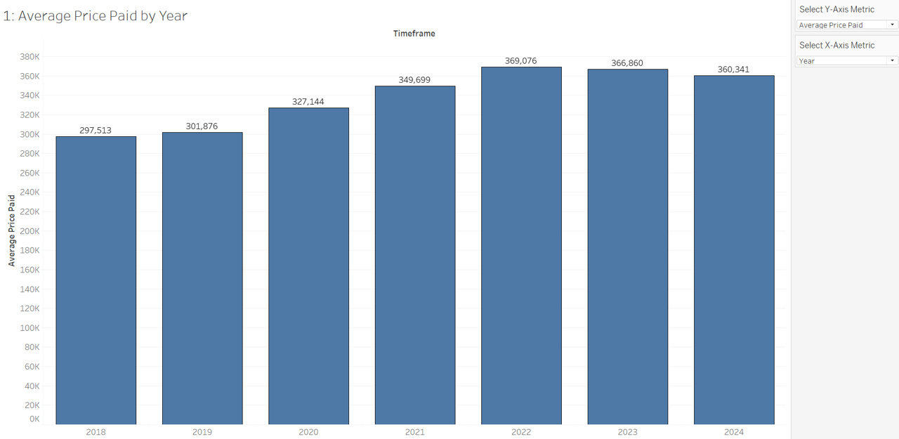

Below is a screenshot of my dashboard, showing the volume of transactions paid per year.

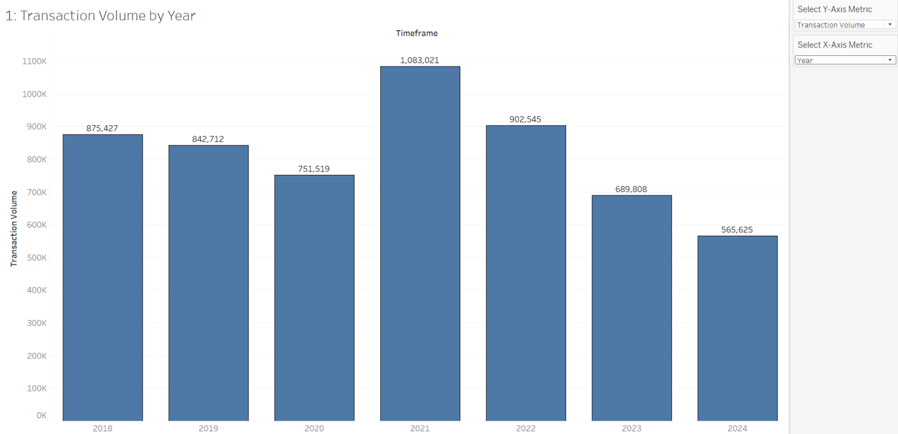

As you can see in both images, the filters on the right:
- **Select Y-Axis Metric**: Allows filtering between average price paid, or the transaction volume.
- **Select X-Axis Metric**: Allows filtering between year, month and quarter.

Explore the Property Summary Dashboard in more detail here: [View Summary Dashboard](https://public.tableau.com/app/profile/vikram.kapoor6816/viz/HMLR_price_paid_dashboard/PropertySummaryDashboard)

Explore the Property Attribute Dashboard in more detail here: [View Attribute Dashboard](https://public.tableau.com/app/profile/vikram.kapoor6816/viz/HMLR_price_paid_dashboard/PropertyAttributesDashboard?publish=yes)

### Insights

- The average price paid for a property increased by 21% between 2018 and 2024.
- The transaction volume peaked in 2021 at 1,083,021 sales, before steadily declining to an all-time low of 565,625 in 2024 - a 48% decrease in just three years.
- The average price paid for a property in any given month is near enough equal in each month, roughly averaging £340,000 with no significant fluctuations either way. The same applies for when analysed by season.
- The volume of transactions for each month fluctuates far more, with June averaging the most transactions at 554,681, and April averaging the least at 393,576.
- Quarterly trends indicate that Q1 and Q2 see approximately 100,000 fewer transactions than Q3 and Q4, highlighting a stronger housing market in the latter half of the year.

## Part 2: Regional Price Insights

Understanding regional price variations helps investors, home buyers, and policymakers make informed decisions about where to invest, buy, or regulate housing markets.

### Methodology

The following should be investigated:
- What are the most expensive and most affordable counties / towns?
- How are property prices distributed geographically?
- Are there any emerging high-growth areas where prices are rising quickly?

SQL Queries:
- Compute the average property price per county / district. 
- Following this, rank the top 20 and bottom 20.

Tableau Visuals:
- Heat map showing the average price paid / volume of transactions for each county with a filter for year.
- Heat map showing the percentage change in the average price paid / volume of transactions for each county between 2018 and 2024.
- Horizontal bar chart showing the top 10 counties with the highest average price paid / volume of transactions
- Horizontal bar chart showing the top 10 counties with the highest percentage change for the average price paid / volume of transactions between 2018 and 2024.

### Key Supporting Query Code

The below SQL code computes the average sales price for each district by joining the FACT_price_paid and the DIM_location tables using location_id as the link.

```sql
-- Computes average sales price for each district (and refers which country a district belongs)
SELECT l.county,
       l.district,
       AVG(f.price) AS avg_price
FROM FACT_price_paid f
LEFT OUTER JOIN DIM_location l
ON f.location_id = l.location_id
GROUP BY l.county,
         l.district;
```
To get the top 20, we lift the exact same code as above, but we use ORDER BY on the average price, make it DESC (descending: largest to smallest values) and LIMIT 20 (shown below). To get the bottom 20, make ASC (ascending: smallest to largest) instead

```sql
-- Computes top 20 most expensive districts in the UK to buy
SELECT l.county,
       l.district,
       AVG(f.price) AS avg_price
FROM FACT_price_paid f
LEFT OUTER JOIN DIM_location l
ON f.location_id = l.location_id
GROUP BY l.county,
         l.district
ORDER BY avg_price DESC
LIMIT 20;
```
The below SQL code computes the percentage change in average sales price for each district between the years 2018 and 2024 by joining the FACT_price_paid and the DIM_location tables using location_id as the link as well as the FACT_price_paid with DIM_date using date_of_transfer_id as a link. We utilise FILTER to get values that map to a specific year, and we use CASE to basically write the SQL version of an if statement to calculate percentage change.

```sql
-- Computes the percentage change on average price for each district from 2018 to 2024
SELECT l.county,
       l.district,
       -- Get 2018 and 2024 average prices
       AVG(f.price) FILTER (WHERE d.year = 2018) AS avg_price_2018,
       AVG(f.price) FILTER (WHERE d.year = 2024) AS avg_price_2024,
       -- Calculate percentage change
       CASE 
            WHEN AVG(f.price) FILTER (WHERE d.year = 2018) IS NOT NULL 
            AND AVG(f.price) FILTER (WHERE d.year = 2018) > 0 
            THEN 
                ((AVG(f.price) FILTER (WHERE d.year = 2024) 
                - AVG(f.price) FILTER (WHERE d.year = 2018)) 
                / AVG(f.price) FILTER (WHERE d.year = 2018)) * 100
        ELSE NULL
        END AS percentage_change
FROM FACT_price_paid f
LEFT OUTER JOIN DIM_location l
ON f.location_id = l.location_id
LEFT OUTER JOIN DIM_date d
ON f.date_of_transfer_id = d.date_of_transfer_id
WHERE d.year IN (2018, 2024) -- Only include relevant years
GROUP BY l.county, 
         l.district
ORDER BY percentage_change DESC;
```

**NOTE**: The same can also be done for volume of transactions by replacing 'AVG(f.price) AS avg_price' with 'COUNT(f.transaction_id) AS number_of_transactions'. 

View the workbook with the full breakdown of each query made here: [Regional Price Workbook](5_project_queries/2_regional_price.sql)

### Dashboard Reference: Visualisations

Below is a screenshot of my dashboard, showing the average price paid by county.

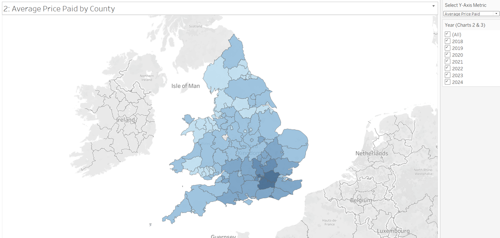

Below is a screenshot of my dashboard, the top 10 counties with the highest average price paid for properties.

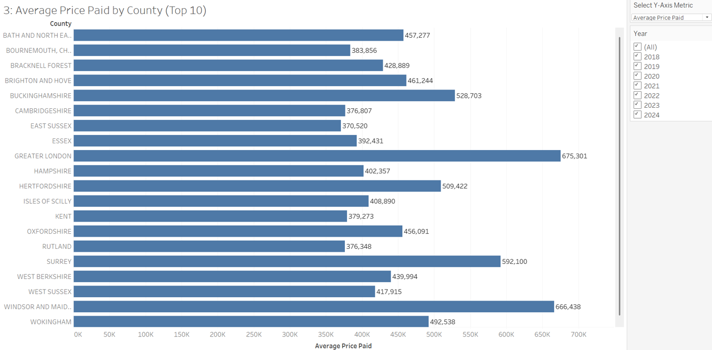

As you can see in both images, the filters on the right:
- **Select Y-Axis Metric**: Allows filtering between average price paid, or the transaction volume.
- **Year**: Allows filtering between a specific year between 2018 and 2024, multiple years, or all years.

**NOTE**: For the percentage change version of these charts, the year filter is not available, as it calculates the percentage chhange between years 2018 and 2024 auomatically.

Explore the Property Summary Dashboard in more detail here: [View Summary Dashboard](https://public.tableau.com/app/profile/vikram.kapoor6816/viz/HMLR_price_paid_dashboard/PropertySummaryDashboard)

Explore the Property Attribute Dashboard in more detail here: [View Attribute Dashboard](https://public.tableau.com/app/profile/vikram.kapoor6816/viz/HMLR_price_paid_dashboard/PropertyAttributesDashboard?publish=yes)

### Insights

- The highest average property prices are in Greater London (£675,301), Windsor and Maidenhead (£666,438), and Surrey (£592,100).
- All of the 20 most expensive districts are either within London or its suburbs, with the exception of Windsor and Maidenhead.
- Kensington & Chelsea (£2,276,247), Westminster (£1,806,791), and Camden (£1,166,648) rank as the top three most expensive districts.
- The most affordable counties are Blaenau Gwent (£127,721), Hull (£135,994), and Blackpool (£136,909).
- The highest transaction volumes were recorded in Greater London (599,234), Greater Manchester (254,616), and West Yorkshire (220,863).
- The lowest transaction volumes were in the Isles of Scilly (125), Poole (3,198), and Bournemouth (3,818).
- Greater London’s transaction volume is more than double that of Greater Manchester, highlighting its dominance in the housing market.
- Birmingham (75,764), Leeds (75,001), and Cornwall (66,317) saw the highest transaction volumes at the district level.
- The districts with the lowest transaction volumes were the Isles of Scilly (125), West Somerset (720), and Purbeck (886).
- None of the 20 districts with the highest transaction volumes were located in Greater London.
- Counties with the highest percentage increase in average price (2018 to 2024) include Windsor and Maidenhead (58.7%), the Isles of Scilly (46.4%), and Bournemouth (44.8%)—ironically, two of these counties had some of the lowest transaction volumes.
- Despite leading in both average price and transaction volume, Greater London had the lowest percentage price increase (10.9%) among the top 20 counties.
- Every county experienced a decline in transaction volume (2018 to 2024), indicating an overall drop in property sales.
- The sharpest declines in transaction volume were seen in the West Midlands (-42.6%), Lincolnshire (-39.9%), and Greater Manchester (-39.2%).
- The top five fastest-growing property markets (2018–2024), based on percentage price increases, were:
  - Windsor and Maidenhead (+58.6%)
  - Folkestone, Kent (+57.1%)
  - Blaenau Gwent (+50.3%)
  - Runnymede, Surrey (+49.1%)
  - Isles of Scilly (+46.4%)

## Part 3: Property Type Comparison

Different property types appreciate at different rates, affecting investment value and buyer affordability.

### Methodology

The following should be investigated:
- How do detached, semi-detached, terraced and flats compare in price?
- How do detached, semi-detached, terraced and flats compare in price by year or region?
- Which property type has the highest volume of transactions?
- Which property type has the highest volume of transactions by year or region?

SQL Queries & Tableau Visuals:
- Calculate average price per property type (D, S, T, F) (overall, by year and by region)
- Calculate which property type (D, S, T, F) has the highest volume of transactions (overall, by year, and by region)

Tableau Visuals: 
- Bar chart showing the average price paid / volume of transactions by property type with a filter for which years, as well as which property types to include.
- Heat map showing the average price paid / volume of transactions for each county by property type with a filter for year.
- Heat map showing the percentage change in the average price paid / volume of transactions for each county between 2018 and 2024 by property type.

### Key Supporting Query Code

The below SQL code computes the average sales price for each property type by joining the FACT_price_paid and the DIM_property_type tables using proeprty_type_id as the link.

```sql
-- Computes average sales price for each Property Type
SELECT t.property_type,
       AVG(f.price) AS avg_price
FROM FACT_price_paid f
LEFT OUTER JOIN DIM_property_type t
ON f.property_type_id = t.property_type_id
GROUP BY t.property_type
;
```
The below SQL code computes the percentage change in average sales price for each property type between the years 2018 and 2024 by joining the FACT_price_paid and the DIM_property_type tables using location_id as the link as well as the FACT_price_paid with DIM_date using date_of_transfer_id as a link. We utilise FILTER to get values that map to a specific year, and we use CASE to basically write the SQL version of an if statement to calculate percentage change.

``` sql
-- Computes the percentage change on average price for each property type from 2018 to 2024
SELECT t.property_type,
       AVG(f.price) FILTER (WHERE d.year = 2018) AS avg_price_2018,
       AVG(f.price) FILTER (WHERE d.year = 2024) AS avg_price_2024,
       CASE 
            WHEN AVG(f.price) FILTER (WHERE d.year = 2018) IS NOT NULL 
            AND AVG(f.price) FILTER (WHERE d.year = 2018) > 0 
            THEN 
                ((AVG(f.price) FILTER (WHERE d.year = 2024) 
                - AVG(f.price) FILTER (WHERE d.year = 2018)) 
                / AVG(f.price) FILTER (WHERE d.year = 2018)) * 100
        ELSE NULL
        END AS percentage_change
FROM FACT_price_paid f
LEFT OUTER JOIN DIM_property_type t
ON f.property_type_id = t.property_type_id
LEFT OUTER JOIN DIM_date d
ON f.date_of_transfer_id = d.date_of_transfer_id
WHERE d.year IN (2018, 2024)
GROUP BY t.property_type
ORDER BY percentage_change DESC;
```

**NOTE**: The same can also be done for volume of transactions by replacing 'AVG(f.price) AS avg_price' with 'COUNT(f.transaction_id) AS number_of_transactions'. 

View the workbook with the full breakdown of each query made here: [Property Type Workbook](5_project_queries/3_property_type.sql)

### Dashboard Reference: Visualisations

Below is a screenshot of my dashboard, showing the average price paid for each property type.

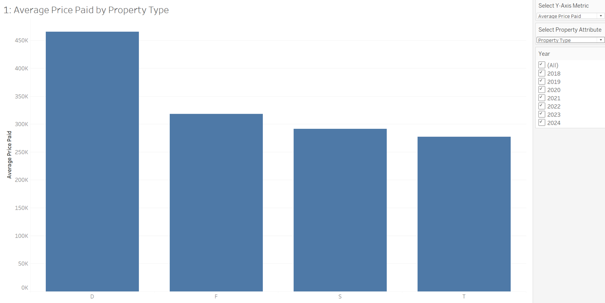

Below is a screenshot of my dashboard, showing the average price paid for a detached house in each county.

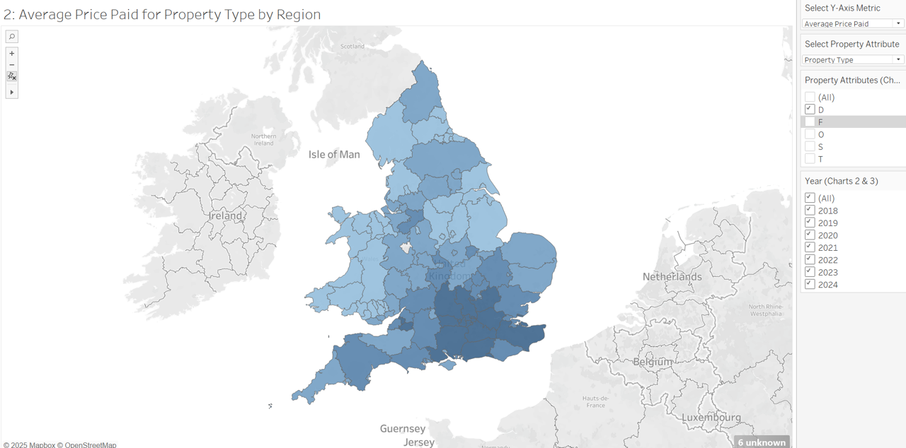

Below is a screenshot of my dashboard, showing the top 10 counties with the highest average price paid for a detached home.

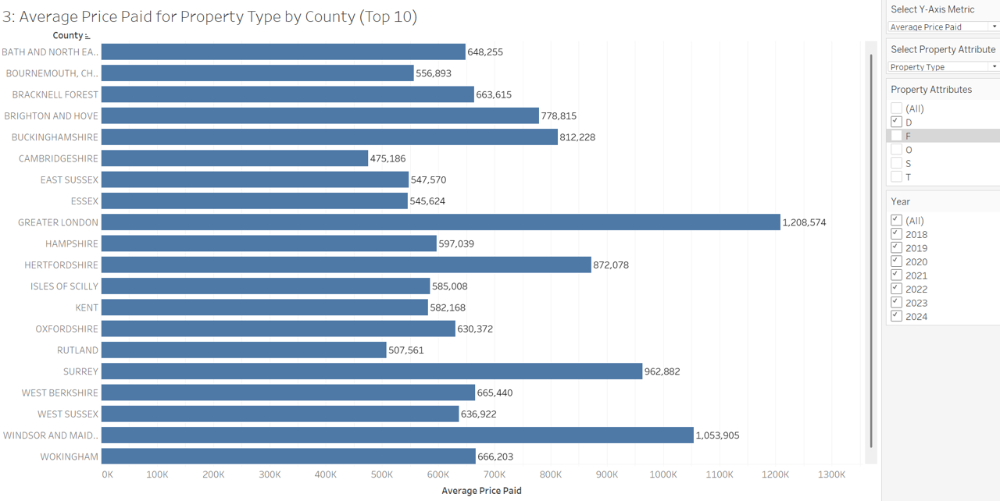

As you can see in both images, the filters on the right:
- **Select Y-Axis Metric**: Allows filtering between average price paid, or the transaction volume.
- **Select Property Attribute**: Allows filtering between property type, property age or property duration.
- **Property Attributes**: Allows filtering between D (detached), F (flat), S (semi-detached) and or T (terraced) property types
- **Year**: Allows filtering between a specific year between 2018 and 2024, multiple years, or all years.

**NOTE**: For the percentage change version of these charts, the year filter is not available, as it calculates the percentage chhange between years 2018 and 2024 auomatically.

Explore the Property Summary Dashboard in more detail here: [View Summary Dashboard](https://public.tableau.com/app/profile/vikram.kapoor6816/viz/HMLR_price_paid_dashboard/PropertySummaryDashboard)

Explore the Property Attribute Dashboard in more detail here: [View Attribute Dashboard](https://public.tableau.com/app/profile/vikram.kapoor6816/viz/HMLR_price_paid_dashboard/PropertyAttributesDashboard?publish=yes)

### Insights

Detached Homes:

- Highest average prices were recorded in Greater London (£1,208,574), Windsor and Maidenhead (£1,053,906), Surrey (£962,882), and Hertfordshire (£872,078).
- Rapid price growth in Wales, with Blaenau Gwent (+48.8%), Merthyr Tydfil (+46.6%), and Carmarthenshire (+41.7%) leading the way.
- Highest transaction volumes were in Essex (52,805), Hampshire (50,233), and West Yorkshire, Norfolk, Lincolnshire, and Kent (each roughly around 44,000 transactions).
- All counties saw a decline in detached home sales (2018 to 2024), with the West Midlands (-44.7%), Derbyshire (-43.2%), and West Yorkshire (-43.9%) experiencing the sharpest drops.

Flats:

- Highest average prices were found in Greater London (£568,593), Windsor and Maidenhead (£375,938), and Surrey (£306,379).
- Other high-value areas outside London: Bath and North East Somerset (£331,038), Bristol (£276,639), and York (£223,154).
- The Isles of Scilly had the highest price increase for flats (+76.5%), followed by Powys (+55.3%) and Rhondda Cynon Taff (+43.9%) in Wales.
- Greater London dominated flat sales (319,560 transactions), with no other county coming close (Greater Manchester: 41,244, West Midlands: 33,222).
- The West Midlands saw the steepest decline in flat transactions (-51.4%), followed by Merseyside (-49.76%), Lincolnshire (-48.4%), and Kent (-45.9%).
- Every county recorded a decline in flat sales (2018 to 2024).

Semi-Detached:

- Highest average prices were recorded in Greater London (£734,977), Windsor and Maidenhead (£539,388), Hertfordshire (£540,766), and Surrey (£532,600).
- Other high-value areas included Brighton and Hove (£533,370) and Bath and North East Somerset (£420,113).
- Wales experienced the largest price growth for semi-detached homes, with Merthyr Tydfil (+48.9%), Caerphilly (+45.4%), and the Isle of Anglesey (+42.6%) topping the list.
- Other notable growth areas: Greater Manchester (+37.9%), Nottinghamshire (+33.6%), and Bristol (+32.05%).
- Highest transaction volumes were in Greater Manchester (90,948), Greater London (88,564), and West Yorkshire (80,285).
- The largest declines in semi-detached home sales (2018 to 2024) occurred in the West Midlands (-39.7%) and Devon (-38.6%).
- All counties experienced a decline in semi-detached home transactions over this period.

Terraced:

- Highest average prices were recorded in Greater London (£757,100), Windsor and Maidenhead (£658,325), and Brighton and Hove (£529,811).
- Windsor and Maidenhead saw the most dramatic price growth (+258.8%), far exceeding the average 13% growth among the rest of the top 10 counties.
- Highest transaction volumes were in Greater London (161,913), Greater Manchester (88,591), and West Yorkshire (75,299).
- The largest declines in terraced home transactions (2018 to 2024) were in the West Midlands (-40.2%) and Lincolnshire (-44%).
- Every county recorded a decline in terraced home sales during this period.

Overall:

- Detached homes have the highest average price (£465,587), followed by flats (£318,043), semi-detached (£291,108), and terraced (£277,245).
- Semi-detached homes were the most purchased property type, with 1,654,341 sales, followed by terraced (1,555,122), detached (1,499,123), and flats (1,002,071).
- Terraced homes experienced the highest price increase (26%) between 2018 and 2024, closely followed by semi-detached (25.9%) and detached (25.4%).
- Flat prices remained stable, with only a 5% increase over the same period.
- Transaction volumes followed a binomial pattern, increasing until 2021, before declining to levels lower than 2018 by 2024.

## Part 4: Duration Impact on Pricing (Freehold Vs Leasehold)

Understanding how duration impacts property value helps investors, banks, and home buyers assess long-term ownership costs and market demand.

### Methodology

The following should be investigated:
- Do Freehold properties (F) sell at a higher prices than Leasehold (L) properties?
-	Do Freehold properties (F) sell at a higher prices than Leasehold (L) properties in particular years or regions?
- Are there differences in the proportion of Freehold Vs Leasehold sales?
- Are there differences yearly in the proportion of Freehold Vs Leasehold sales?
- Are there regional differences in the proportion of Freehold Vs Leasehold sales?

SQL Queries:
- Compare the average price of Freehold Vs Leasehold properties (overall, by year and by region)
- Calculate which duration (F, L) has the highest volume of transactions (overall, by year and by region)

Tableau Visuals: 
- Bar chart showing the average price paid / volume of transactions by property duration with a filter for which years, as well as which property types to include.
- Heat map showing the average price paid / volume of transactions for each county by property duration with a filter for year.
- Heat map showing the percentage change in the average price paid / volume of transactions for each county between 2018 and 2024 by property duration.

### Key Supporting Query Code

This section would be exactly the same as the previous property type section except that the code computes the average sales price for each property duration by joining the FACT_price_paid and the DIM_duration tables using duration_id as the link, instead of property_type_id. An example of the repurposed query is as follows:

```sql
-- Computes average sales price for each Duration
SELECT du.duration,
       AVG(f.price) AS avg_price
FROM FACT_price_paid f
LEFT OUTER JOIN DIM_duration du
ON f.duration_id = du.duration_id
GROUP BY du.duration
;
```
**NOTE**: The same can also be done for volume of transactions by replacing 'AVG(f.price) AS avg_price' with 'COUNT(f.transaction_id) AS number_of_transactions'. 

View the workbook with the full breakdown of each query made here: [Duration Workbook](5_project_queries/4_duration_impact.sql)

### Dashboard Reference: Visualisations

Below is a screenshot of my dashboard, showing the average price paid for each property duration.

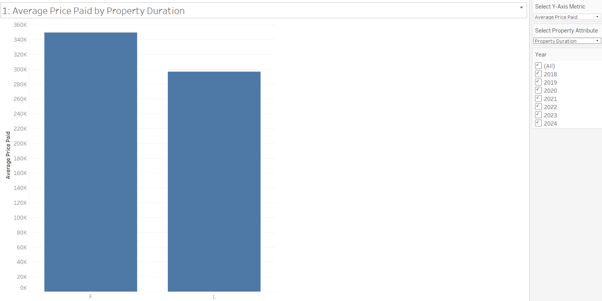

Below is a screenshot of my dashboard, showing the average price paid for a freehold house in each county.

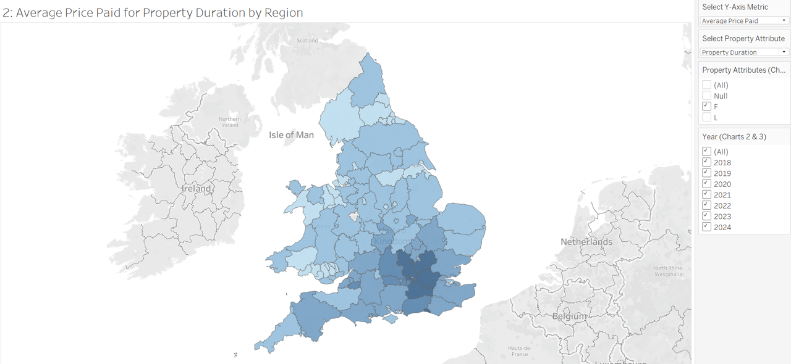

Below is a screenshot of my dashboard, showing the top 10 counties with the highest average price paid for a freehold home.

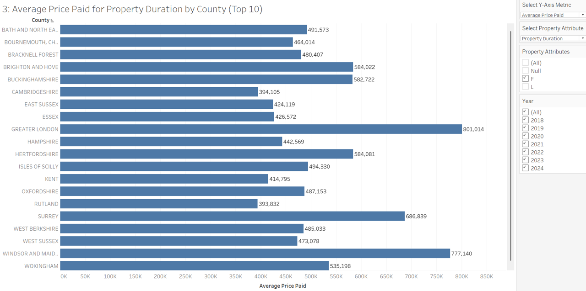

As you can see in both images, the filters on the right:
- **Select Y-Axis Metric**: Allows filtering between average price paid, or the transaction volume.
- **Select Property Attribute**: Allows filtering between property type, property age or property duration.
- **Property Attributes**: Allows filtering between F (freehold), and or L (leasehold) property duration
- **Year**: Allows filtering between a specific year between 2018 and 2024, multiple years, or all years.

**NOTE**: For the percentage change version of these charts, the year filter is not available, as it calculates the percentage chhange between years 2018 and 2024 auomatically.

Explore the Property Summary Dashboard in more detail here: [View Summary Dashboard](https://public.tableau.com/app/profile/vikram.kapoor6816/viz/HMLR_price_paid_dashboard/PropertySummaryDashboard)

Explore the Property Attribute Dashboard in more detail here: [View Attribute Dashboard](https://public.tableau.com/app/profile/vikram.kapoor6816/viz/HMLR_price_paid_dashboard/PropertyAttributesDashboard?publish=yes)

### Insights

Freehold:

- Highest average freehold prices were recorded in Greater London (£801,014), Windsor and Maidenhead (£777,147), and Surrey (£686,839).
- Notable high-value areas outside London: Bath and North East Somerset (£591,573) and Brighton and Hove (£582,044).
- The steepest price growth (2018 to 2024) was in Windsor and Maidenhead (+68.6%), significantly outpacing other high-growth areas such as the Isles of Scilly, Rutland, and Bath and North East Somerset (each having roughly a 33% increase).
- The highest freehold transaction volumes were recorded in Greater London (273,365), West Yorkshire (190,461), and the West Midlands (166,549).
- Greater Manchester (123,529) also had a high transaction volume, despite being further from London.
- All counties experienced a decline in freehold transaction volumes (2018–2024), with the most significant drops occurring in the West Midlands (-40.5%), Lincolnshire (-39.5%), Devon (-38.9%), and Derbyshire (-37.7%).

Leasehold:

- Highest average leasehold prices were recorded in Greater London (£569,842), Windsor and Maidenhead (£380,160), and Bath and North East Somerset (£353,819).
- The Isles of Scilly saw the highest leasehold price increase (+76.2%) between 2018 and 2024.
- Some counties experienced a decline in leasehold property values, including Windsor and Maidenhead (-8.91%), Buckinghamshire (-1.26%), Wokingham (-5.96%), West Berkshire (-8.91%), and Rutland (-6.43%).
- Leasehold transactions were most concentrated in Greater London (325,869) and Greater Manchester (131,087).
- No other county had comparable leasehold transaction volumes, with the West Midlands (43,301) and Lancashire (40,363) ranking next.
- All counties saw a decline in leasehold transactions between 2018 and 2024, with the largest reductions in the West Midlands (-50.1%), Lincolnshire (-45.9%), Merseyside (-46.8%), and Kent (-44.9%). 

Overall:

- Freehold properties command a higher average price (£349,599) compared to leasehold properties (£296,694).
- Freehold sales significantly outnumber leasehold sales, with 4.44 million transactions recorded for freehold homes versus 1.27 million for leasehold properties.
- Between 2018 and 2024, freehold property prices increased by 24.3%, while leasehold prices saw a more modest rise of 8%.
- Transaction volumes declined for both property types over the same period, with freehold transactions dropping by 34.4% and leasehold transactions falling by 38.8%.

## Part 5: Transactions by Property Age (New Vs Old Properties)

New-build properties may have different pricing trends and market appeal compared to older homes.

### Methodology

The following should be investigated:
- Do newly built properties (Y) sell at a premium compared to established properties (N)?
- Do newly built properties (Y) sell at a premium compared to established properties (N) in particular years or regions?
- Which property age has the highest volume of transactions?
- Which property age has the highest volume of transactions by year or region?

SQL Queries:
- Calculate average price per property age (overall, by year and by region).
- Calculate which property age has the highest volume of transactions (overall, by year, and by region).

Tableau Visuals: 
- Bar chart showing the average price paid / volume of transactions by property age with a filter for which years, as well as which property types to include.
- Heat map showing the average price paid / volume of transactions for each county by property age with a filter for year.
- Heat map showing the percentage change in the average price paid / volume of transactions for each county between 2018 and 2024 by property age.

### Key Supporting Query Code

This section would be exactly the same as the property type section except that the code computes the average sales price for each property type by joining the FACT_price_paid and the DIM_old_or_new tables using old_or_new_id as the link, instead of property_type_id. We've also already seen how the query can be repurposed for duration in the previous property duration section. This was just repeated for property age.

View the workbook with the full breakdown of each query made here: [Property Type Workbook](5_project_queries/5_property_age.sql)

### Dashboard Reference: Visualisations

Below is a screenshot of my dashboard, showing the average price paid for each property age.

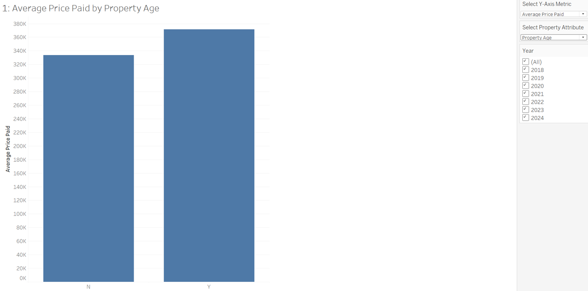

Below is a screenshot of my dashboard, showing the average price paid for a newly furbished property

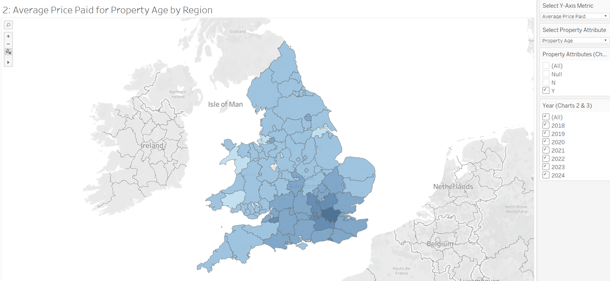

Below is a screenshot of my dashboard, showing the top 10 counties with the highest average price paid for a newly furbished property.

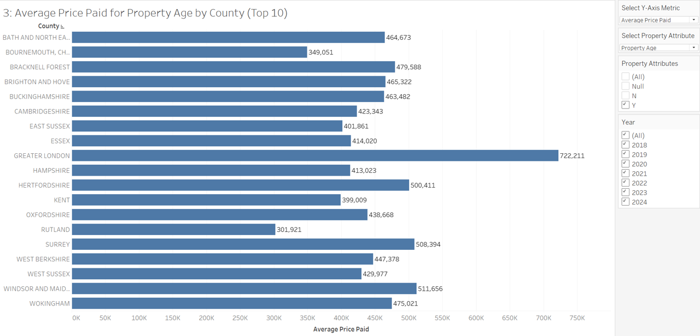

As you can see in both images, the filters on the right:
- **Select Y-Axis Metric**: Allows filtering between average price paid, or the transaction volume.
- **Select Property Attribute**: Allows filtering between property type, property age or property duration.
- **Property Attributes**: Allows filtering between Y (new build) and or N (established residential build) property ages.
- **Year**: Allows filtering between a specific year between 2018 and 2024, multiple years, or all years.

**NOTE**: For the percentage change version of these charts, the year filter is not available, as it calculates the percentage chhange between years 2018 and 2024 auomatically.

Explore the Property Summary Dashboard in more detail here: [View Summary Dashboard](https://public.tableau.com/app/profile/vikram.kapoor6816/viz/HMLR_price_paid_dashboard/PropertySummaryDashboard)

Explore the Property Attribute Dashboard in more detail here: [View Attribute Dashboard](https://public.tableau.com/app/profile/vikram.kapoor6816/viz/HMLR_price_paid_dashboard/PropertyAttributesDashboard?publish=yes)

### Insights

Newly Built Property:

- The highest average new-build prices were recorded in Greater London (£722,211), Windsor and Maidenhead (£511,656), Surrey (£508,394), and Hertfordshire (£500,411).
- Notable high-value areas outside London include Bath and North East Somerset (£464,673).
- Bournemouth, Christchurch, and Poole saw the largest price increase (+88.2%) between 2018 and 2024, followed by West Berkshire (+58.9%), Bath and North East Somerset (+51.8%), and Brighton and Hove (+46.8%).
- Some counties saw a decline in new-build property values, with Gwynedd (-43.7%) and the Isle of Anglesey (-12.9%) experiencing the steepest drops.
- Greater London led in new-build transaction volume (71,077 sales), followed by Greater Manchester (26,873).
- Additional regions with notable transaction activity include Kent (19,839), Essex (18,947), West Yorkshire (19,936), West Midlands (16,754), Lancashire (15,793), and Hampshire (16,651).
- All counties recorded a decline in new-build transactions (2018–2024), with the West Midlands (-92.8%), Greater London (-91.6%), Surrey (-90.1%), and Merseyside (-89.4%) experiencing the sharpest drops.

Established Residential Build:

- The highest average prices for established homes were found in Greater London (£568,593), Windsor and Maidenhead (£375,938), and Surrey (£306,379).
- Other high-value locations outside London include Bath and North East Somerset (£331,038), Bristol (£276,639), and York (£223,154).
- Transaction volumes were highest in Greater London (528,157), Greater Manchester (227,743), and West Yorkshire (200,927).
- All counties saw a decline in established home transactions between 2018 and 2024, with Cumbria experiencing a complete collapse (-100%).
- Other areas with significant declines in transaction volume include the West Midlands (-38.4%), Lincolnshire (-35.5%), and Greater Manchester (-33.6%).

Overall: 

- New-build properties are priced higher than established homes, with an average sale price of £371,681 vs. £333,557.
- Between 2018 and 2024, established home prices increased by 23%, while new builds saw a smaller rise of 17.5%.
- Established homes dominate the market, accounting for 5.07 million sales, compared to just 644,912 new-build transactions.
- Transaction volumes declined significantly for both property types during this period, with established homes down by 28% and new builds experiencing a sharp 84.8% drop.

# Overall Insights 

## House Prices and Market Trends
- Property prices have steadily increased between 2018 and 2024, with an overall rise of 21%.
Transaction volume peaked in 2021 (1.08M sales) but then declined sharply by 48%, reaching an all-time low of 565,625 sales in 2024.
- No significant seasonal price fluctuations were observed, with monthly prices averaging £340,000.
- Transaction volumes, however, show seasonal variation, with June having the highest sales (554,681) and April the lowest (393,576).
- Q3 and Q4 experience 100,000 more transactions than Q1 and Q2, indicating a stronger housing market in the latter half of the year.

## Regional Price Variations
- Greater London (£675,301), Windsor and Maidenhead (£666,438), and Surrey (£592,100) have the highest average property prices.
- All 20 of the most expensive districts are in London or its suburbs, except for Windsor and Maidenhead.
- Kensington & Chelsea (£2.28M), Westminster (£1.81M), and Camden (£1.17M) are the most expensive districts.
- Blaenau Gwent (£127,721), Hull (£135,994), and Blackpool (£136,909) are the most affordable counties.
- Greater London leads in transaction volume (599,234), followed by Greater Manchester (254,616) and West Yorkshire (220,863).
- The Isles of Scilly (125 sales), Poole (3,198), and Bournemouth (3,818) have the lowest transaction volumes.
- Despite having the highest property prices, Greater London saw the lowest price growth (+10.9%) among the top 20 counties.
- The sharpest declines in transaction volume (2018–2024) were in the West Midlands (-42.6%), Lincolnshire (-39.9%), and Greater Manchester (-39.2%).

## Property Type Analysis
- Detached homes have the highest average price (£465,587), followed by flats (£318,043), semi-detached (£291,108), and terraced (£277,245).
- Semi-detached homes are the most frequently purchased property type (1.65M sales), followed by terraced (1.56M), detached (1.50M), and flats (1.00M).
- Terraced homes saw the highest price increase (+26%) between 2018 and 2024, followed closely by semi-detached (+25.9%) and detached (+25.4%).
- Flat prices remained stable, increasing by just 5% during the same period.
- Transaction volumes followed a binomial pattern, peaking in 2021 before declining below 2018 levels by 2024.

## Freehold vs. Leasehold
- Freehold properties have a higher average price (£349,599) than leasehold properties (£296,694).
- Freehold transactions (4.44M sales) significantly outnumber leasehold transactions (1.27M).
- Between 2018 and 2024, freehold property prices increased by 24.3%, while leasehold prices rose by only 8%.
- Transaction volumes declined for both tenure types, with freehold transactions dropping by 34.4% and leasehold transactions falling by 38.8%.
- Windsor and Maidenhead (+68.6%) led in freehold price growth, while the Isles of Scilly (+76.2%) saw the highest leasehold price increase.
- Leasehold transactions dropped most sharply in the West Midlands (-50.1%), Lincolnshire (-45.9%), Merseyside (-46.8%), and Kent (-44.9%).

## New Builds vs. Established Homes
- New-build properties are priced higher (£371,681) than established homes (£333,557).
Between 2018 and 2024, established home prices increased by 23%, while new builds saw a smaller rise of 17.5%.
- Established homes dominate the market, accounting for 5.07M sales, compared to just 644,912 new-build transactions.
- Transaction volumes declined significantly for both property types, with established homes down 28% and new builds experiencing a drastic 84.8% drop.
- The highest new-build prices were in Greater London (£722,211), Windsor and Maidenhead (£511,656), and Surrey (£508,394).
- Bournemouth, Christchurch, and Poole saw the highest new-build price growth (+88.2%), while Gwynedd (-43.7%) had the sharpest decline.
- All counties saw a decline in new-build sales, with the steepest drops in the West Midlands (-92.8%), Greater London (-91.6%), and Surrey (-90.1%).

## Summary of Key Market Trends
- House prices have increased significantly (21%) overall, but transaction volumes have dropped sharply (-48%) since 2021.
- The housing market remains strongest in Greater London, despite having the lowest price growth among top counties.
- Semi-detached homes are the most purchased property type, while terraced homes have appreciated the most (+26%).
- Freehold properties are more expensive and dominate the market, but their transaction volumes have declined significantly (-34.4%).
- New-build transactions have collapsed (-84.8%), reflecting a shift away from new developments.
- Wales, despite having relatively low transaction volumes, has experienced strong property price growth, particularly in areas such as Blaenau Gwent (+50.3%), Powys (+55.3%), and Merthyr Tydfil (+46.6%).
- Seasonal transaction trends indicate that sales are higher in Q3 and Q4 than in Q1 and Q2.
- Regional disparities are significant, with some areas like Windsor and Bournemouth experiencing rapid growth, while others like the West Midlands and Greater Manchester face severe transaction declines.

# Challenges Faced
This project came with its share of challenges, but each obstacle provided valuable learning experiences and opportunities for growth.

- **Defining Business-Relevant Inquiries**: Identifying the most valuable questions to explore, those with strong business context and stakeholder relevance, required extra research and thinking. 
- **Handling Data Updates & Completeness**: Ensuring that all property transactions for 2024 were included despite potential delays in dataset updates required careful validation and cross-checking.
- **Data Cleaning & Preparation**: Standardising inconsistent entries, handling missing values, and ensuring a high-quality dataset for analysis demanded significant effort in pre-processing. 
- **Loading and Structuring Data in SQL**: Choosing the correct data types and ensuring the smooth transfer of raw data into well-structured tables posed an initial challenge, requiring thoughtful database design. Some ammendements had to be made to the initial datatypes chosen so the data could be loaded.
- **Dashboard Design Complexity**: Building an intuitive and insightful dashboard involved balancing clarity and depth, ensuring key trends were effectively visualised without overwhelming the user.
- **Extracting Meaningful Insights**: With endless possible analyses, selecting the most impactful insights from dashboards and SQL queries required a focused, data-driven approach to avoid information overload.

# Conclusion: Link Back to Business Context

The insights from this project provide actionable intelligence for various stakeholders in the real estate, financial, and public sectors. Here’s how each group can use these findings to make informed, data-driven decisions:

## Home Buyers and Sellers

### Insights Gained

- **Affordable Areas Identified**: Blaenau Gwent, Hull, and Blackpool offer the lowest average prices.
- **Transaction Trends**: Prices are rising despite declining transaction volumes, meaning market conditions favor sellers in high-growth areas and buyers in declining markets.
- **Market Timing**: Q3 and Q4 have higher transaction volumes, making them the best times to sell a property for higher demand.

### Real-World Application

- **Buyers**: Can target undervalued locations with high potential for appreciation (e.g., Powys, Blaenau Gwent).
- **Sellers**: Should consider timing their sales in Q3 or Q4 to benefit from higher transaction volumes and better price negotiations.

## Property Investors & Developers

### Insights Gained

- **High-Growth Markets**: Strong appreciation in areas like Windsor & Maidenhead (+58.6%), Folkestone (+57.1%), and Powys (+55.3%).
- **Declining Markets to Avoid**: Areas with falling transaction volumes like the West Midlands (-42.6%), Lincolnshire (-39.9%), and Greater Manchester (-39.2%) may present risks.
- **Emerging Opportunities**: Despite low transaction volumes, Wales is showing strong price appreciation, particularly in semi-detached and detached homes.

### Real-World Application

- **Investors**: Should target high-growth areas like Windsor and Maidenhead or Powys, while avoiding stagnant or overpriced regions like Central London.
- **Developers**: Can focus on residential projects in Wales to capitalize on price growth trends in undervalued markets.

## Banks and Mortgage Brokers

### Insights Gained

- **Stable Vs. Volatile Markets**: Freehold properties have seen higher price increases (+24.3%) than leasehold properties (+8%), suggesting lower risk in financing freehold purchases.
- **Declining New-Build Market**: The sharp drop in new-build sales (-84.8%) raises concerns about overvaluation and financing risks for new developments.
- **Regional Mortgage Risks**: Greater London leads in price stability but has weaker growth, whereas areas like Blaenau Gwent and Powys are higher-risk, high-reward markets.

### Real-World Application

- **Banks**: Can adjust mortgage rates and approval criteria based on market volatility (e.g., offering stricter terms for new-build financing but more competitive rates in high-growth freehold markets).
- **Mortgage Brokers**: Can tailor loan products for high-growth areas, offering better terms in regions with strong price appreciation and stable demand.

## Local Government & Urban Planners

### Insights Gained

- **Wales’ Potential for Housing Demand**: Despite low transaction volumes, some Welsh regions are experiencing high price growth, indicating future demand for housing projects.
- **Declining Sales in Major Metropolitan Areas**: The West Midlands (-42.6%) and Greater Manchester (-39.2%) have seen significant transaction volume declines, signaling potential issues with affordability or supply shortages.
- **Stronger Q3/Q4 Sales Trends**: Development planning should prioritize project launches in high-demand periods.

### Real-World Application

- Urban planners should consider infrastructure investment in Wales and other high-growth regions.
- Local governments can introduce housing incentives in regions with declining transactions, such as the West Midlands and Lincolnshire, to stimulate buyer interest.

## Housing Policy Makers

### Insights Gained

- **Affordability Concerns**: London remains unaffordable despite slower growth, while other regions are rapidly increasing in price (e.g., Bournemouth +44.8%).
- **Freehold Vs. Leasehold Divide**: Freehold properties have appreciated three times faster than leasehold properties, raising concerns about leasehold affordability.
- **New-Build Decline**: The sharp drop in new-build transactions (-84.8%) suggests a lack of buyer interest, potentially due to affordability constraints or poor availability.

### Real-World Application

- **Regulation on Leaseholds**: Address rising costs and affordability to stabilize price growth in key regions.
- **Support for First-Time Buyers in High-Growth Areas**: Introduce affordable housing policies in Wales and the South West to balance out demand shifts.
- **Incentives for New-Build Developments**: Provide tax relief or grants to stimulate new housing supply in declining transaction markets.

## Property Agents & Solicitors

### Insights Gained

- **Buyers Shifting to Regional Markets**: High price growth in non-London areas suggests that buyers are increasingly looking outside the capital.
- **Q3/Q4 Are the Best Times to Sell**: Transaction volumes are higher in the latter half of the year, meaning sellers can maximize their sale price by listing strategically.
- **Flats Remain the Most Stable Asset**: Prices have barely changed (+5%), meaning long-term stability in urban rental markets.

### Real-World Application

- **Agents**: Should advise buyers to consider emerging markets in Wales and the South West, where prices are rising but remain affordable.
- **Solicitors**: Can educate clients on freehold vs. leasehold ownership benefits, given the significant gap in price growth.
- **Sellers**: Should list properties in Q3/Q4 to take advantage of higher transaction volumes.

## Final Takeaways

These insights provide valuable, real-world applications for stakeholders across investment, finance, government, and real estate sectors. The housing market is shifting, with trends indicating:
- Rising property prices but declining transaction volumes.
- High-growth markets emerging outside London, particularly in Wales and the South West.
- Challenges in leasehold affordability and new-build stagnation.
- Opportunities for policy intervention and financial adjustments based on transaction volume trends.


